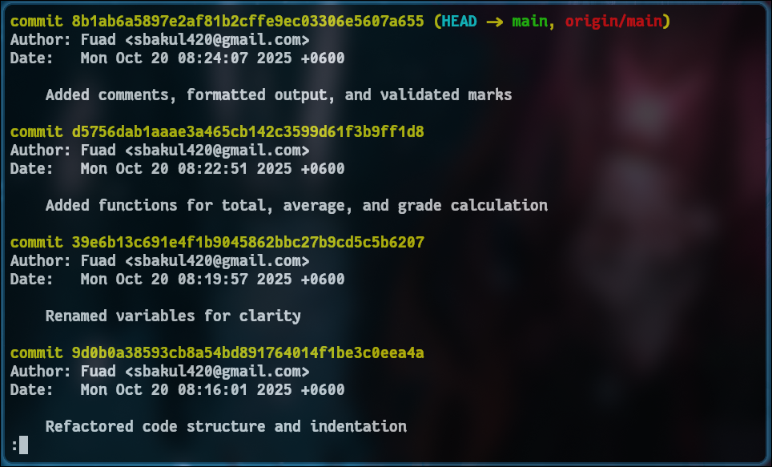

# Student Marks Program

## Overview
This project demonstrates refactoring messy code into clean, readable, and maintainable code following clean code principles. It also tracks progress using Git version control.

## Features
- Modular functions for total, average, and grade calculations
- Formatted output
- Fail grade handling
- Clear, meaningful variable names
- Git commits demonstrate step-by-step improvement

## Git Log Screenshot
